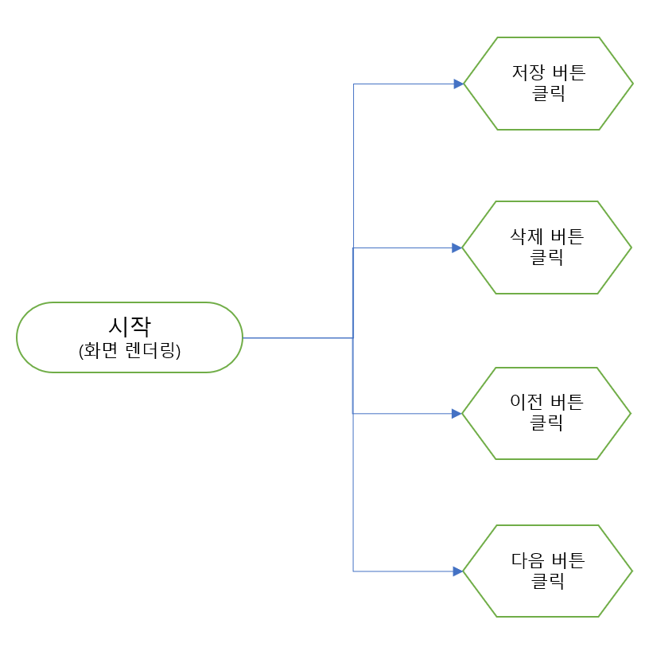

타임머신 에디터
=====
## 목차
1. [요구사항](#요구사항)
2. [설계](#설계)
	1. [화면설계](#화면설계)
	2. [flowchart](#flowchart)
3. [코드](#코드)
4. [참고](#참고)

## 요구사항
- [ ] 화면 구성 요소는 텍스트 입력창, 버튼 3개(이전, 다음, 저장), 박스 1개(현재 위치/전체 개수)다
- [ ] 저장 버튼을 누르면 `전체 개수 + 1`이 되고 마지막 저장 내용으로 현재 위치가 이동한다
- [ ] 이전 및 다음 버튼 클릭 시 현재 위치가 각각 -1, +1이 되며 텍스트 입력창은 해당 내용을 불러온다

- - -
* 개발일정
* 개발인원

##### [목차로 이동](#목차)

## 설계
### 화면설계
 

##### [목차로 이동](#목차)

### flowchart
 

1. [저장](#저장)
2. [삭제](#삭제)
3. [이전](#이전)
4. [다음](#다음)

##### [목차로 이동](#목차)

#### 저장
 

##### [flowchart로 이동](#flowchart)

#### 삭제
 

##### [flowchart로 이동](#flowchart)

#### 이전
 

##### [flowchart로 이동](#flowchart)

#### 다음
 

##### [flowchart로 이동](#flowchart)

## 코드

##### [목차로 이동](#목차)

## 참고

##### [목차로 이동](#목차)